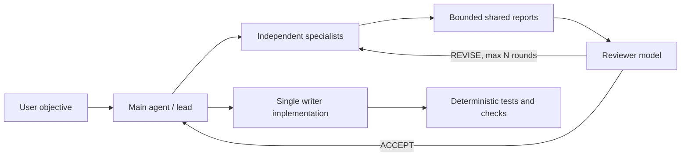

# Multi-Model Team Cockpit

Skein's team mode treats models as replaceable specialists, not fixed brand
stereotypes. A project can route `frontend`, `backend`, `architect`, `research`,
`security`, `tester`, and `reviewer` profiles to different providers. The main
agent remains the only writer; specialists inspect independently, exchange
bounded reports, and a reviewer accepts or requests one revision round.

## Why This Shape

Current products validate parts of the experience:

- [Claude Code agent teams](https://code.claude.com/docs/en/agent-teams) use a
  lead, independent context windows, a shared task list, direct teammate
  messages, and optional split panes. Anthropic still labels the feature
  experimental and documents coordination and shutdown limitations.
- [Aider Architect mode](https://aider.chat/2024/09/26/architect.html) reports
  better editing results when planning/reasoning and editing are assigned to
  separate model calls.
- [Microsoft AutoGen Selector Group Chat](https://microsoft.github.io/autogen/stable/user-guide/agentchat-user-guide/selector-group-chat.html)
  demonstrates model-selected speakers and bounded termination conditions.
- [Codeg](https://github.com/xintaofei/codeg),
  [ufoo](https://github.com/Icyoung/ufoo),
  [agtx](https://github.com/fynnfluegge/agtx), and
  [comux](https://github.com/BunsDev/comux) explore multi-CLI aggregation,
  shared blackboards, visible terminals, tmux, and worktree isolation.

The product gap is not opening the maximum number of terminals. It is making
routing, authority, evidence, cost, cancellation, disagreement, and acceptance
understandable in one place.

Official model claims also change quickly. OpenAI describes current reasoning
models as suitable for complex coding and multi-step agentic work in its
[reasoning guide](https://developers.openai.com/api/docs/guides/reasoning),
while provider-specific releases publish their own benchmarks. Those claims are
useful priors, not permanent role assignments. Skein should eventually learn
workspace-specific routing from accepted/rejected outcomes, latency, cost, and
test results.

## Interaction Contract

In the TUI:

```text
/team Design and validate session sharing across worktrees
```

The main transcript remains on the left. At 100 columns or wider, a Team
Cockpit appears on the right with the active profile, provider/model route,
phase (`work`, `review`, or `revision`), state, and recent peer handoffs. Narrow
terminals keep the same information in the normal timeline.

The workflow is:



This is intentionally not a free-form infinite group chat. Every run has an
objective, bounded specialists, a reviewer, a revision cap, cancellation
propagation, and a deterministic return value. By default, Skein persists a
local Team Run manifest under the active namespace's `team-runs/` directory.
Reports and peer handoffs are content-addressed blobs; the manifest stores
hashes, phases, providers, models, and acceptance status.

Inspect or remove runs with:

```bash
skein agents runs
skein agents show <run-id-or-prefix>
skein agents delete <run-id-or-prefix> --yes
```

Set `agents.persistBoard` to `false` when a session must not retain team
reports. The normal default is local persistence because it makes interrupted
runs, reviewer disagreements, and delivery audits recoverable without sending
the blackboard to a hosted service.

## Configuration

Credentials are referenced by environment-variable name. They are never stored
inside the project config.

```json
{
  "agents": {
    "enabled": true,
    "maxConcurrent": 3,
    "maxDelegations": 6,
    "reviewerProfile": "reviewer",
    "maxReviewRounds": 1,
    "cockpit": true,
    "routes": {
      "research": {
        "runtime": "grok",
        "provider": "compatible",
        "model": "your-grok-model"
      },
      "frontend": {
        "runtime": "claude",
        "provider": "anthropic",
        "model": "your-frontend-model"
      },
      "backend": {
        "runtime": "codex",
        "provider": "openai",
        "model": "your-reasoning-model"
      },
      "reviewer": {
        "provider": "gemini",
        "model": "your-review-model",
        "apiKeyEnv": "GEMINI_API_KEY"
      }
    }
  }
}
```

`runtime` defaults to `api`. The initial external adapters invoke installed
`codex`, `claude`, or `grok` binaries without a shell and enforce each CLI's
read-only/plan mode, bounded output, timeout, abort signal, and non-persistent
session option. Their existing login/config owns credentials. External output
is normalized into the same peer-report protocol, so API and CLI teammates can
participate in one council.

Routes loaded from repository-owned config are ignored until the project is
trusted because a malicious endpoint could exfiltrate environment credentials
or source context.

## Current Safety Boundary

- Specialist agents are read-only and cannot recursively delegate.
- Only the main agent may mutate the active workspace.
- Peer messages are summaries capped before entering another context.
- Review rounds are capped at three by schema and default to one.
- Cancellation uses the parent abort signal.
- Model routes inherit a credential only when provider and endpoint match the
  parent; otherwise an explicit `apiKeyEnv` is required.

## Next Increments

1. Add provider-native search/tool adapters so a research route can use live
   search without granting arbitrary shell/network authority.
2. Persist a content-addressed team blackboard and compact provenance bundle.
3. Add per-route token, cost, latency, and tool budgets.
4. Add worktree-isolated writer agents with explicit merge/review gates.
5. Score routes from project-local eval outcomes instead of relying on model
   brand assumptions.
6. Add Gemini CLI and optional tmux/iTerm visible-pane hosts. Codex, Claude,
   and Grok headless adapters already use the shared event and acceptance
   protocol.
