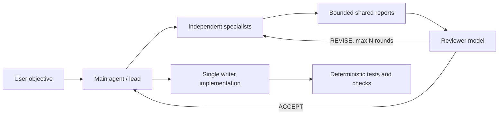

# Multi-Model Team Cockpit

Skein's team mode treats models as replaceable specialists, not fixed brand
stereotypes. A project can route `frontend`, `backend`, `architect`, `research`,
`security`, `tester`, and `reviewer` profiles to different providers. The main
agent remains the only writer; specialists inspect independently, exchange
bounded reports, and a reviewer accepts or requests one revision round.

## Why This Shape

Current products validate parts of the experience:

- [Claude Code agent teams](https://code.claude.com/docs/en/agent-teams) use a
  lead, independent context windows, a shared task list, direct teammate
  messages, and optional split panes. Anthropic still labels the feature
  experimental and documents coordination and shutdown limitations.
- [Aider Architect mode](https://aider.chat/2024/09/26/architect.html) reports
  better editing results when planning/reasoning and editing are assigned to
  separate model calls.
- [Microsoft AutoGen Selector Group Chat](https://microsoft.github.io/autogen/stable/user-guide/agentchat-user-guide/selector-group-chat.html)
  demonstrates model-selected speakers and bounded termination conditions.
- [Codeg](https://github.com/xintaofei/codeg),
  [ufoo](https://github.com/Icyoung/ufoo),
  [agtx](https://github.com/fynnfluegge/agtx), and
  [comux](https://github.com/BunsDev/comux) explore multi-CLI aggregation,
  shared blackboards, visible terminals, tmux, and worktree isolation.

The product gap is not opening the maximum number of terminals. It is making
routing, authority, evidence, cost, cancellation, disagreement, and acceptance
understandable in one place.

Official model claims also change quickly. OpenAI describes current reasoning
models as suitable for complex coding and multi-step agentic work in its
[reasoning guide](https://developers.openai.com/api/docs/guides/reasoning),
while provider-specific releases publish their own benchmarks. Those claims are
useful priors, not permanent role assignments. Skein should eventually learn
workspace-specific routing from accepted/rejected outcomes, latency, cost, and
test results.

## Interaction Contract

In the TUI:

```text
/team Design and validate session sharing across worktrees
```

The main transcript remains on the left. At 100 columns or wider, a Team
Cockpit appears on the right with the active profile, provider/model route,
phase (`work`, `review`, or `revision`), state, and recent peer handoffs. Narrow
terminals keep the same information in the normal timeline.

Press `Ctrl+T` or run `/workbench` to focus the interactive Team Workbench. It
switches between `Agents`, `Tasks`, and `Messages`; arrow keys select an item,
`Enter` expands the selected report and observable alerts, `s` stops a running
Agent, `r` requests a fresh attempt for a running Agent, and `Esc` returns to
the transcript. The focused view uses the full available width, including on
narrow terminals, so the same run summary and safe telemetry remain available
without exposing hidden chain-of-thought. Completed Agents are immutable in
this first control pass; their persisted reports remain available through the
Team Run inspection commands.

The workflow is:



This is intentionally not a free-form infinite group chat. Every run has an
objective, bounded specialists, a reviewer, a revision cap, cancellation
propagation, and a deterministic return value. By default, Skein persists a
local Team Run manifest under the active namespace's `team-runs/` directory.
Reports and peer handoffs are content-addressed blobs; the manifest stores
hashes, phases, providers, models, and acceptance status.

Inspect or remove runs with:

```bash
skein agents runs
skein agents show <run-id-or-prefix>
skein agents delete <run-id-or-prefix> --yes
```

Set `agents.persistBoard` to `false` when a session must not retain team
reports. The normal default is local persistence because it makes interrupted
runs, reviewer disagreements, and delivery audits recoverable without sending
the blackboard to a hosted service.

## Configuration

Credentials are referenced by environment-variable name. They are never stored
inside the project config.

### Authentication paths

Skein keeps subscription login and API routing separate because they have
different ownership and billing semantics:

- Subscription users authenticate once in each installed official CLI. Codex
  supports ChatGPT subscription login, Claude Code supports Claude.ai/Teams
  login, and Gemini CLI supports Google account login. A Skein route with
  `runtime: "codex"`, `"claude"`, or `"grok"` reuses that CLI's local login;
  Skein does not read, copy, or persist its tokens.
- Direct API users reference the provider's environment variable on each
  route, or let a compatible parent route inherit the same endpoint.
- Relay/gateway users define one named `connection` and reuse it across model
  routes. This matches gateways such as OpenRouter or LiteLLM that expose many
  models behind one OpenAI-compatible endpoint and bearer key.

Official authentication references: [Codex](https://developers.openai.com/codex/auth),
[Claude Code](https://code.claude.com/docs/en/authentication), and
[Gemini CLI](https://geminicli.com/docs/get-started/authentication/). Unified
gateway examples: [OpenRouter](https://openrouter.ai/docs/quickstart) and
[LiteLLM](https://docs.litellm.ai/docs/learn/gateway_quickstart).

```json
{
  "agents": {
    "enabled": true,
    "maxConcurrent": 3,
    "maxDelegations": 6,
    "reviewerProfile": "reviewer",
    "maxReviewRounds": 1,
    "cockpit": true,
    "budgetMode": "observe",
    "routes": {
      "research": {
        "runtime": "grok",
        "provider": "compatible",
        "model": "your-grok-model"
      },
      "frontend": {
        "runtime": "claude",
        "provider": "anthropic",
        "model": "your-frontend-model"
      },
      "backend": {
        "runtime": "codex",
        "provider": "openai",
        "model": "your-reasoning-model"
      },
      "reviewer": {
        "provider": "gemini",
        "model": "your-review-model",
        "apiKeyEnv": "GEMINI_API_KEY"
      }
    }
  }
}
```

For a relay that exposes many model families through one key, configure the
credential once in the user environment:

```bash
export TEAM_RELAY_API_KEY="..."
```

For the common case, set one team default. Every profile inherits this
connection and model, so there is no need to repeat the same block for each
role. Add a profile entry only when that role needs a different model:

```json
{
  "agents": {
    "defaultConnection": "team-relay",
    "defaultModel": "openai/coding-model",
    "connections": {
      "team-relay": {
        "provider": "compatible",
        "baseUrl": "https://relay.example/v1",
        "apiKeyEnv": "TEAM_RELAY_API_KEY"
      }
    },
    "routes": {
      "frontend": {"model": "anthropic/frontend-model"},
      "reviewer": {"model": "openai/reviewer-model"}
    }
  }
}
```

The equivalent fully explicit form is still supported when different roles
need different connections:

```json
{
  "agents": {
    "connections": {
      "team-relay": {
        "provider": "compatible",
        "baseUrl": "https://relay.example/v1",
        "apiKeyEnv": "TEAM_RELAY_API_KEY"
      }
    },
    "routes": {
      "architect": {
        "connection": "team-relay",
        "model": "anthropic/architecture-model"
      },
      "backend": {
        "connection": "team-relay",
        "model": "openai/coding-model"
      },
      "frontend": {
        "connection": "team-relay",
        "model": "google/frontend-model"
      },
      "reviewer": {
        "connection": "team-relay",
        "model": "openai/reviewer-model"
      }
    }
  }
}
```

Run `skein agents connections` or `/connections` to inspect the resolved
endpoint, environment-variable reference, and route count without revealing
the key. For compatible/OpenAI connections, run
`skein agents models team-relay` to inspect the provider's `/models` catalog
before choosing route IDs. Discovery is read-only and does not rewrite config;
native Anthropic/Gemini subscription catalogs remain owned by their official
CLIs. Named connections are best kept in user-level configuration. A
repository-owned connection or route remains disabled until the project config
is explicitly trusted, preventing a cloned repository from redirecting a
developer's key and source context to an attacker-controlled endpoint.

Routing precedence is explicit and predictable: a profile route overrides team
defaults; a route that specifies `provider` without `connection` bypasses the
default connection; otherwise the current parent model is used when no team
default is configured. `skein agents list`, `/agents`, and `/team` show whether
each profile uses the parent, team default, or a profile override.

`runtime` defaults to `api`. The initial external adapters invoke installed
`codex`, `claude`, or `grok` binaries without a shell and enforce each CLI's
read-only/plan mode, bounded output, parent cancellation, and non-persistent
session option. Their existing login/config owns credentials. External output
is normalized into the same peer-report protocol, so API and CLI teammates can
participate in one council.

Routes loaded from repository-owned config are ignored until the project is
trusted because a malicious endpoint could exfiltrate environment credentials
or source context.

Budget thresholds are opt-in policy, not a default task-size limit:

- `observe` is the default. Skein records token, tool, and elapsed-time
  telemetry but does not warn or stop a worker. Configured thresholds are
  ignored for enforcement in this mode.
- `guard` compares telemetry with configured thresholds, emits a soft warning,
  and lets the worker continue.
- `strict` enforces configured thresholds and may stop a worker. Use it only
  when a user or an automation explicitly needs a hard ceiling.

Team-wide thresholds use `maxAgentTokens`, `maxAgentToolCalls`, and
`agentTimeoutMs`. Each route may override them with `tokenBudget`,
`maxToolCalls`, `timeoutMs`, and its own `budgetMode`. For example:

```json
{
  "agents": {
    "budgetMode": "guard",
    "maxAgentTokens": 120000,
    "maxAgentToolCalls": 120,
    "agentTimeoutMs": 600000,
    "routes": {
      "reviewer": {
        "budgetMode": "strict",
        "tokenBudget": 30000
      }
    }
  }
}
```

These task thresholds are separate from a model's context window and Skein's
session compaction/context limits. A context boundary still exists because a
provider cannot accept an unlimited prompt; it is not treated as a user task
budget.

The Team Cockpit shows observable phase, current tool, elapsed time, token
usage, tool count, soft warnings, and final acceptance state. It deliberately
does not show hidden chain-of-thought; model reports, peer handoffs, tool
activity, and reviewer decisions are the explainable artifacts.

## Current Safety Boundary

- Specialist agents are read-only and cannot recursively delegate.
- Only the main agent may mutate the active workspace.
- Peer messages are summaries capped before entering another context.
- Review rounds are capped at three by schema and default to one.
- Cancellation uses the parent abort signal.
- Model routes inherit a credential only when provider and endpoint match the
  parent; otherwise an explicit `apiKeyEnv` is required.

## Next Increments

1. Add provider-native search/tool adapters so a research route can use live
   search without granting arbitrary shell/network authority.
2. Persist a content-addressed team blackboard and compact provenance bundle.
3. Add per-route cost accounting and user-confirmed spend controls.
4. Add worktree-isolated writer agents with explicit merge/review gates.
5. Score routes from project-local eval outcomes instead of relying on model
   brand assumptions.
6. Add Gemini CLI and optional tmux/iTerm visible-pane hosts. Codex, Claude,
   and Grok headless adapters already use the shared event and acceptance
   protocol.
