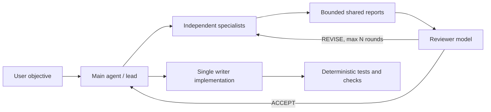

# Multi-Model Team Cockpit

Skein's team mode treats models as replaceable specialists, not fixed brand
stereotypes. A project can route `frontend`, `backend`, `architect`, `research`,
`security`, `tester`, and `reviewer` profiles to different providers. The main
agent remains the only writer of the active workspace; specialists inspect
independently, exchange bounded reports, and a reviewer accepts or requests one
revision round. An opt-in writer lane may prepare a patch in a disposable Git
worktree, but it cannot integrate that patch itself.

## Why This Shape

Current products validate parts of the experience:

- [Claude Code agent teams](https://code.claude.com/docs/en/agent-teams) use a
  lead, independent context windows, a shared task list, direct teammate
  messages, and optional split panes. Anthropic still labels the feature
  experimental and documents coordination and shutdown limitations.
- [Aider Architect mode](https://aider.chat/2024/09/26/architect.html) reports
  better editing results when planning/reasoning and editing are assigned to
  separate model calls.
- [Microsoft AutoGen Selector Group Chat](https://microsoft.github.io/autogen/stable/user-guide/agentchat-user-guide/selector-group-chat.html)
  demonstrates model-selected speakers and bounded termination conditions.
- [Codeg](https://github.com/xintaofei/codeg),
  [ufoo](https://github.com/Icyoung/ufoo),
  [agtx](https://github.com/fynnfluegge/agtx), and
  [comux](https://github.com/BunsDev/comux) explore multi-CLI aggregation,
  shared blackboards, visible terminals, tmux, and worktree isolation.

The product gap is not opening the maximum number of terminals. It is making
routing, authority, evidence, cost, cancellation, disagreement, and acceptance
understandable in one place.

Official model claims also change quickly. OpenAI describes current reasoning
models as suitable for complex coding and multi-step agentic work in its
[reasoning guide](https://developers.openai.com/api/docs/guides/reasoning),
while provider-specific releases publish their own benchmarks. Those claims are
useful priors, not permanent role assignments. Skein should eventually learn
workspace-specific routing from accepted/rejected outcomes, latency, cost, and
test results.

## Interaction Contract

In the TUI:

```text
/team Design and validate session sharing across worktrees
```

The main transcript remains on the left. At 100 columns or wider, a Team
Cockpit appears on the right with the active profile, provider/model route,
phase (`work`, `review`, or `revision`), state, and recent peer handoffs. Narrow
terminals keep the same information in the normal timeline.

Press `Ctrl+T` or run `/workbench` to focus the interactive Team Workbench. It
switches between `Agents`, `Tasks`, and `Messages`; arrow keys select an item,
`Enter` expands the selected report and observable alerts, `s` stops a running
Agent, `r` requests a fresh attempt for a running Agent, and `Esc` returns to
the transcript. The focused view uses the full available width, including on
narrow terminals, so the same run summary and safe telemetry remain available
without exposing hidden chain-of-thought. Completed Agents are immutable in
this first control pass; their persisted reports remain available through the
Team Run inspection commands.

The workflow is:


```mermaid
flowchart LR
    U["User objective"] --> L["Main agent / lead"]
    L --> A["Independent specialists"]
    A --> B["Bounded shared reports"]
    B --> R["Reviewer model"]
    R -->|"ACCEPT"| L
    R -->|"REVISE, max N rounds"| A
    L --> W["Single writer implementation"]
    W --> V["Deterministic tests and checks"]
```

This is intentionally not a free-form infinite group chat. Every run has an
objective, bounded specialists, a reviewer, a revision cap, cancellation
propagation, and a deterministic return value. By default, Skein persists a
local Team Run manifest under the active namespace's `team-runs/` directory.
Reports and peer handoffs are content-addressed blobs; the manifest stores
hashes, phases, providers, models, and acceptance status.

Inspect or remove runs with:

```bash
skein agents runs
skein agents show <run-id-or-prefix>
skein agents delete <run-id-or-prefix> --yes
```

Set `agents.persistBoard` to `false` when a session must not retain team
reports. The normal default is local persistence because it makes interrupted
runs, reviewer disagreements, and delivery audits recoverable without sending
the blackboard to a hosted service.

Writer runs always persist their audit record even when ordinary council
persistence is disabled. Integration depends on the recorded patch hash,
review verdict, base commit, file list, cleanup result, and checkpoint.

## Isolated Writer Lane

The first writer lane is deliberately opt-in and single-lane:

```json
{
  "agents": {
    "writerEnabled": true,
    "writerProfile": "implementer",
    "writerReviewerProfile": "reviewer",
    "maxWriterPatchBytes": 60000
  }
}
```

`writer_run` asks for write, Git, and shell permission, creates a detached
worktree at the current `HEAD`, and gives the writer only `read_file`,
`list_files`, `search_code`, `write_file`, and `apply_patch`. Shell, Git,
network, hooks, MCP, memory, external CLI runtimes, workspace-authored writer
profiles, and recursive agents remain unavailable. The reviewer must also use
an API route so it receives the complete patch. The patch is rejected rather
than truncated above `maxWriterPatchBytes` (60,000 by default; 120,000 maximum).

The worktree is removed and pruned before the tool returns. Team Run v2 stores
the Git `--binary` text patch, SHA-256, base commit, file list, writer and
reviewer reports, cleanup result, and integration state. `skein agents show
<run-id>` displays that evidence.

`writer_integrate` is a separate main-agent action. It requires the accepted
Team Run ID and patch SHA, reparses and bounds every path, requires the same
`HEAD`, refuses dirty target files, runs `git apply --check`, and captures every
target in a checkpoint. A failed apply restores that checkpoint; conflicts are
reported without overwriting the active workspace. A successful result prints
the exact `skein checkpoint restore <session> <checkpoint>` rollback command.

Dirty main-workspace state is not mirrored into the writer worktree. Parallel
writers, automatic merge or rebase, submodule mutation, and external CLI writer
mode remain future increments.

## Configuration

Credentials are referenced by environment-variable name. They are never stored
inside the project config.

### Guided setup

The shortest setup path is the interactive user-level wizard:

```bash
skein agents setup
```

It asks for a connection name, explicit relay transport, inference endpoint,
optional model-catalog endpoint, `env` or `none` authentication, and default
model. The wizard writes only the environment-variable name and saves shared
settings under the user Skein namespace, so the same connection is available
in every workspace. The non-interactive equivalent is useful for provisioning:

```bash
skein agents setup --yes \
  --name team-relay \
  --provider compatible \
  --protocol openai-responses \
  --base-url https://relay.example/v1 \
  --api-key-env TEAM_RELAY_API_KEY \
  --model openai/coding-model
```

Run this command outside an active TUI session; `/connections setup` displays
the same next action without placing a secret in the session transcript.

### Authentication paths

Skein keeps primary relay routing and delegated CLI login separate because they
have different ownership and billing semantics:

- Subscription users authenticate once in each installed official CLI. Codex
  supports ChatGPT subscription login, Claude Code supports Claude.ai/Teams
  login, and Gemini CLI supports Google account login. A Skein route with
  `runtime: "codex"`, `"claude"`, or `"grok"` reuses that CLI's local login;
  Skein does not read, copy, or persist its tokens.
- Existing direct API routes remain readable for backward compatibility; they
  are not the evolution path for new primary connections.
- Relay/gateway users define one named `connection` and reuse it across model
  routes. This matches gateways such as OpenRouter, LiteLLM, and Vercel AI
  Gateway that expose Responses, Chat Completions, and/or Anthropic Messages
  behind one relay credential.

### Primary model connection selection

The primary agent and team routes share the same connection catalog. User
configuration under `agents.connections` is merged with strict named
environment profiles:

```bash
export SKEIN_CONNECTIONS=work,local
export SKEIN_CONNECTION_WORK_PROVIDER=compatible
export SKEIN_CONNECTION_WORK_PROTOCOL=openai-responses
export SKEIN_CONNECTION_WORK_BASE_URL=https://relay.example/v1
export SKEIN_CONNECTION_WORK_API_KEY_ENV=WORK_RELAY_KEY
export SKEIN_CONNECTION_WORK_MODEL=coder
export SKEIN_CONNECTION_LOCAL_PROVIDER=compatible
export SKEIN_CONNECTION_LOCAL_PROTOCOL=openai-chat
export SKEIN_CONNECTION_LOCAL_BASE_URL=http://127.0.0.1:11434/v1
export SKEIN_CONNECTION_LOCAL_AUTH=none
```

IDs are lowercase shell-safe names. IDs that collide after environment
normalization (for example `team-a` and `team_a`) are rejected. Endpoint and
credential fields never cross profile boundaries. Selection precedence is an
explicit `--connection`, the configured default, then automatic selection only
when exactly one complete profile exists. Multiple complete profiles open a
TTY selector; headless runs fail with `Pass --connection <name>`.

New named connections are relay-only: `provider` is `compatible`, authentication
is exactly `env` or `none`, and the transport is `openai-responses`,
`openai-chat`, or `anthropic-messages`. OAuth, keychain, command helpers, and
official account login are not connection schema variants. Custom legacy native
provider endpoints do not inherit the provider's official API key.

Responses is the default because OpenAI recommends it for new projects. Skein
sets `store: false` and replays the complete returned output items plus tool
outputs on the next request, which also works with stateless relay
implementations. Protocol failures never trigger an automatic request through a
different transport, avoiding duplicate inference and billing.

Some relays publish two SDK base URLs for the same account. The OpenAI base
usually includes `/v1`; the Anthropic base may be a root or provider prefix and
expects the client to append `/v1/messages`. This is why inference `baseUrl` and
OpenAI-style `modelsBaseUrl` are distinct. An Anthropic transport must configure
`modelsBaseUrl` explicitly:

```json
{
  "provider": "compatible",
  "protocol": "anthropic-messages",
  "baseUrl": "https://relay.example/anthropic",
  "modelsBaseUrl": "https://relay.example/v1",
  "defaultModel": "anthropic/coding-model",
  "auth": {"type": "env", "name": "TEAM_RELAY_API_KEY"}
}
```

Official authentication references: [Codex](https://developers.openai.com/codex/auth),
[Claude Code](https://code.claude.com/docs/en/authentication), and
[Gemini CLI](https://geminicli.com/docs/get-started/authentication/). Unified
gateway examples: [OpenRouter](https://openrouter.ai/docs/quickstart) and
[LiteLLM](https://docs.litellm.ai/docs/learn/gateway_quickstart).
Transport references: [OpenAI Responses migration](https://developers.openai.com/api/docs/guides/migrate-to-responses),
[OpenRouter Responses](https://openrouter.ai/docs/api/reference/responses/overview),
[OpenRouter Anthropic Messages](https://openrouter.ai/docs/api/api-reference/anthropic-messages/create-a-message),
[LiteLLM supported endpoints](https://docs.litellm.ai/docs/supported_endpoints),
and [Vercel AI Gateway APIs](https://vercel.com/docs/ai-gateway/sdks-and-apis).

```json
{
  "agents": {
    "enabled": true,
    "maxConcurrent": 3,
    "maxDelegations": 6,
    "reviewerProfile": "reviewer",
    "maxReviewRounds": 1,
    "cockpit": true,
    "budgetMode": "observe",
    "routes": {
      "research": {
        "runtime": "grok",
        "provider": "compatible",
        "model": "your-grok-model"
      },
      "frontend": {
        "runtime": "claude",
        "provider": "anthropic",
        "model": "your-frontend-model"
      },
      "backend": {
        "runtime": "codex",
        "provider": "openai",
        "model": "your-reasoning-model"
      },
      "reviewer": {
        "provider": "gemini",
        "model": "your-review-model",
        "apiKeyEnv": "GEMINI_API_KEY"
      }
    }
  }
}
```

For a relay that exposes many model families through one key, configure the
credential once in the user environment:

```bash
export TEAM_RELAY_API_KEY="..."
```

For the common case, set one team default. Every profile inherits this
connection and model, so there is no need to repeat the same block for each
role. Add a profile entry only when that role needs a different model:

```json
{
  "agents": {
    "defaultConnection": "team-relay",
    "defaultModel": "openai/coding-model",
    "connections": {
      "team-relay": {
        "provider": "compatible",
        "protocol": "openai-responses",
        "baseUrl": "https://relay.example/v1",
        "defaultModel": "openai/coding-model",
        "auth": {"type": "env", "name": "TEAM_RELAY_API_KEY"}
      }
    },
    "routes": {
      "frontend": {"model": "anthropic/frontend-model"},
      "reviewer": {"model": "openai/reviewer-model"}
    }
  }
}
```

The equivalent fully explicit form is still supported when different roles
need different connections:

```json
{
  "agents": {
    "connections": {
      "team-relay": {
        "provider": "compatible",
        "protocol": "openai-responses",
        "baseUrl": "https://relay.example/v1",
        "auth": {"type": "env", "name": "TEAM_RELAY_API_KEY"}
      }
    },
    "routes": {
      "architect": {
        "connection": "team-relay",
        "model": "anthropic/architecture-model"
      },
      "backend": {
        "connection": "team-relay",
        "model": "openai/coding-model"
      },
      "frontend": {
        "connection": "team-relay",
        "model": "google/frontend-model"
      },
      "reviewer": {
        "connection": "team-relay",
        "model": "openai/reviewer-model"
      }
    }
  }
}
```

Run `skein agents connections` or `/connections` to inspect the resolved
inference endpoint, model-catalog endpoint, environment-variable reference,
and route count without revealing the key. Run `skein agents models
team-relay` to inspect the relay's OpenAI-style `/models` catalog before
choosing route IDs. Discovery is read-only and does not rewrite config. Its
process-local cache is bounded to 32 endpoint/auth fingerprints with a 15-minute
TTL and ETag revalidation; secret values are hashed into the in-memory
fingerprint and never cached. `401`/`403` invalidates the entry and never returns
stale models as an authentication success. Named connections are best kept in
user-level configuration. A
repository-owned connection or route remains disabled until the project config
is explicitly trusted, preventing a cloned repository from redirecting a
developer's key and source context to an attacker-controlled endpoint.

External CLI runtimes remain separate from native connections. Skein launches
them with a minimal environment containing only the safe executable path,
home/temporary/locale facts, and that runtime's own config directory. Provider
keys, `SKEIN_*` credentials, unrelated connection keys, and `NODE_OPTIONS` are
not inherited by the child process.

Routing precedence is explicit and predictable: a profile route overrides team
defaults; a route that specifies `provider` without `connection` bypasses the
default connection; otherwise the current parent model is used when no team
default is configured. `skein agents list`, `/agents`, and `/team` show whether
each profile uses the parent, team default, or a profile override.

`runtime` defaults to `api`. The initial external adapters invoke installed
`codex`, `claude`, or `grok` binaries without a shell and enforce each CLI's
read-only/plan mode, bounded output, parent cancellation, and non-persistent
session option. Their existing login/config owns credentials. External output
is normalized into the same peer-report protocol, so API and CLI teammates can
participate in one council.

Routes loaded from repository-owned config are ignored until the project is
trusted because a malicious endpoint could exfiltrate environment credentials
or source context.

Budget thresholds are opt-in policy, not a default task-size limit:

- `observe` is the default. Skein records token, tool, and elapsed-time
  telemetry but does not warn or stop a worker. Configured thresholds are
  ignored for enforcement in this mode.
- `guard` compares telemetry with configured thresholds, emits a soft warning,
  and lets the worker continue.
- `strict` enforces configured thresholds and may stop a worker. Use it only
  when a user or an automation explicitly needs a hard ceiling.

Team-wide thresholds use `maxAgentTokens`, `maxAgentToolCalls`, and
`agentTimeoutMs`. Each route may override them with `tokenBudget`,
`maxToolCalls`, `timeoutMs`, and its own `budgetMode`. For example:

```json
{
  "agents": {
    "budgetMode": "guard",
    "maxAgentTokens": 120000,
    "maxAgentToolCalls": 120,
    "agentTimeoutMs": 600000,
    "routes": {
      "reviewer": {
        "budgetMode": "strict",
        "tokenBudget": 30000
      }
    }
  }
}
```

These task thresholds are separate from a model's context window and Skein's
session compaction/context limits. A context boundary still exists because a
provider cannot accept an unlimited prompt; it is not treated as a user task
budget.

The Team Cockpit shows observable phase, current tool, elapsed time, token
usage, tool count, soft warnings, and final acceptance state. It deliberately
does not show hidden chain-of-thought; model reports, peer handoffs, tool
activity, and reviewer decisions are the explainable artifacts.

## Current Safety Boundary

- Specialist agents are read-only and cannot recursively delegate.
- Only the main agent may mutate the active workspace. An enabled writer can
  mutate only its disposable worktree and returns a reviewed patch.
- Writer and integration operations share a repo-scoped exclusive lease, while
  Team Run and checkpoint storage retain their separate namespace leases.
- Workspace-authored profiles cannot receive writer authority, and repository
  config cannot enable or retarget the writer lane without explicit trust.
- Peer messages are summaries capped before entering another context.
- Review rounds are capped at three by schema and default to one.
- Cancellation uses the parent abort signal.
- Model routes inherit a credential only when provider and endpoint match the
  parent; otherwise an explicit `apiKeyEnv` is required.

## Next Increments

1. Add provider-native search/tool adapters so a research route can use live
   search without granting arbitrary shell/network authority.
2. Persist a content-addressed team blackboard and compact provenance bundle.
3. Add per-route cost accounting and user-confirmed spend controls.
4. Add dependency-aware parallel writer worktrees after conflict-rate and
   rollback evidence justify relaxing the single-lane gate.
5. Score routes from project-local eval outcomes instead of relying on model
   brand assumptions.
6. Add Gemini CLI and optional tmux/iTerm visible-pane hosts. Codex, Claude,
   and Grok headless adapters already use the shared event and acceptance
   protocol.
